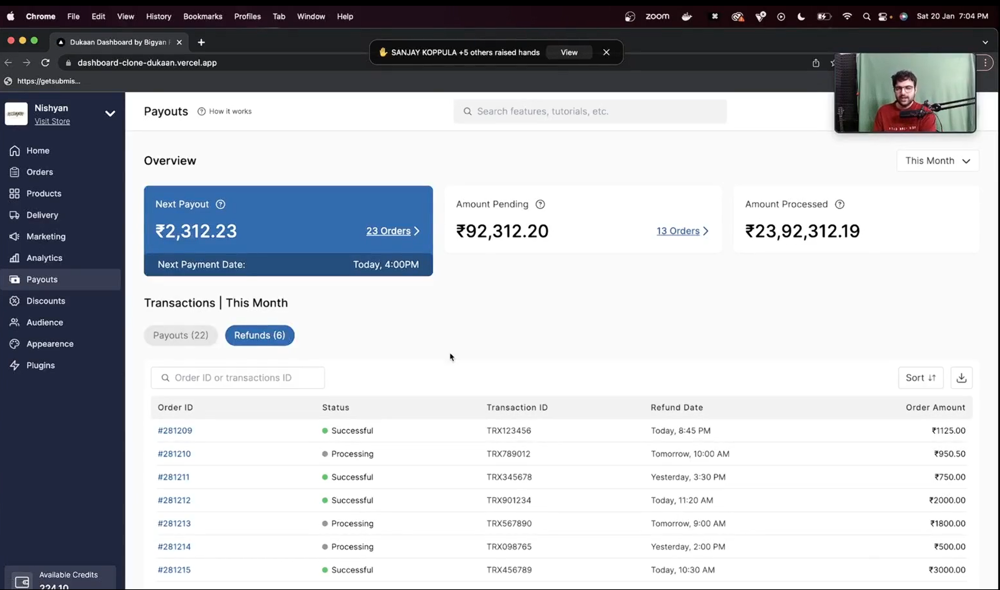

<br />

hello[dukan cto interview by sing in usa](https://youtu.be/jZxYZZ151To?si=DBw-gpDelx3q8kwT)
<br />

hello[dukaan going bare metal](https://youtu.be/vFxQyZX84Ro?si=1utgQIXhUd2pDd1aa)
<br />
<br />
rapid mq , Kubernetes lens , rds , dynamo db , ngnix , fluentbit , elastic , cicd , cncf .  efk stack , elastic search cluster, apache software to store auth logs , anylitics software, yekger siblos for tracing if api is slow you can track up to the database query  ,  tumara koi bhi tech stack kubernetes pe hona chahiye self hostable hona chahiye mai paisa nahi dega -> rule & thinking of cto of dukan while while going to new tech stack , cdn is used for js images etc   they wrote algorithm for image transformation by self ,   they use  bunny ,archamive etc before some time if cloudfare works better then they use cloudflare, whatsappi  is one of the cdn to store the images beacouse google cloud is very expensive so they take backup with whatsappi and store in hard drive , 

cloudflare bhi sql lite data base use karta hai 


asli engineering wale ka project  ->system call hii hamesha koi bhi database ya kafka bhi use karke chiz fast karta hai  to uusne dug db ,postgres , geno db by paypal, padha  500 page ka unix ka system call ka book padha aur bana raha hai
<br />
<br />
<br />
<br />

https://devblogs.microsoft.com/bharry/scaling-git-and-some-back-story/
<br />
<br />


https://graphite.dev/blog/why-facebook-doesnt-use-git

<br />
<br />


https://engineering.fb.com/2014/01/07/core-infra/scaling-mercurial-at-facebook/


<br />
<br />

https://arstechnica.com/information-technology/2017/02/microsoft-hosts-the-windows-source-in-a-monstrous-300gb-git-repository/


<br />
<br />

https://stacking.dev/

<br />
<br />
<br />
<br />
<br />
<br />
<br />
<br />
<br />
<br />
<br />
<br />
can you discuss react query while data fetching and data caching instead of useEffect, shed some light on that

useswr -> a feature created by vercel 
import useSWR from 'swr'
 
 ```js
 import useSWR from 'swr'
 
function Profile() {
  const { data, error, isLoading } = useSWR('/api/user', fetcher)
 
  if (error) return <div>failed to load</div>
  if (isLoading) return <div>loading...</div>
  return <div>hello {data.name}!</div>
}
 ```


<br />
<br />
<br />
<br />
<br />
thsi si created by vercel engineer if we are able to under statngt this project and able to creat we are among the very good developers

it has done the best use of the correct optimal stack for the project

https://dub.co/


<br />
<br />
<br />
<br />


shopify and wordpress are currently 30 % of the internet there is a lot on money on upwork to make plugins for shopify and wordpress


<br />
<br />
<br />
hired in dukaan by making this front end and dummy backend 

the dukaan had arranged open twitter challange and whoever makes the frontend will get hired
[hired in dukan by makin this front end and backend ](https://x.com/subhashchy/status/1744308069751025894)
<br />




<br />
<br />

https://tailwindcomponents.com/cheatsheet/


<br />
<br />

storybook is an thing which help to add creativity in the project where othe ui us designers can come and can intereact

<br />
<br />

gsap library is used for animations in tailwind


<br />
<br />

https://medium.com/@tondawalkar.omkar/primitive-vs-non-primitive-dependencies-in-useeffect-309a38f7919d

<br />
<br />


authify for developers

listed on the product hunt came on top 20

<br />
<br />

auth 0

clerk

kafka

aggregation pipeline

<br />
<br />


shad cn

remix

rust

<br />
<br />

edge beased jam stack

edge based computing

better cdn

edge basesd low latency system

building edge coumputing stack

maggi delivery network

cape theorem

distributed systems

cloude flare ased key value store

cloudflares AP

c consistency a avaiblity p partitioni problem

algolia search

cloud flare key value store

aws lamda function

firecracker 

microvm

dynamo db


<br />
<br />
<br />
<br />
<br />
<br />
<br />
<br />
<br />
<br />
what is migratioin 
<br />
<br />
what is indexign in database
<br />
what is portals in react
<br />
how can we apply ovast security standards in our express app
<br />
what algorithm or indexing thing to choose in which case in database design

<br />
MVC old model of making an application
<br />
why does join become very expensive operation
<br />
hwo to properly use null and undefined which can let to big problem
<br />
rectangle app for mac to resize windows
<br />
differnece btw join view and aggregation of mongo
<br />
how to audit smart contract
<br />
version control in database

liquid base
<br />

servers pricing

per month server price 

pay as you go price

serverless price function

worm pool of server


<br />
<br />
<br />
<br />
<br />
<br />
<br />
why we always do await on json ()

after the initial fetch call only the headers have been read so to parse the body as json fiirst the body data has to be read from the incoming stream and since reading from the TCP stream is asynchronous the json operaion ends up asynchronous

<br />
bob martins clean architecture model

fastify


<br />
<br />
<br />
<br />

we cannot go to dashboard and see all the server logs hence in the real world we use log stash tools  data dog ,sentri is one of the tool
<br />
<br />
<br />
<br />

please make a video or code along on stream on web socket not socket . io for mern stack app

every time i migrate a fresh project via prisma i had to delete earlier data beacouse of drift detected 

cant we connect 2 projects to 1 postgres database via prisma like we used to do mongoose via creating seperate table for seperate projects

how does prisma earn
<br />
<br />
<br />

void is not a strict type in TS so
const hii: ()=>void = ()=>{
  return hii
} 
does not give error

type widening & narrowing in TS good thing to know
<br />
<br />
## RABC in node js

RBAC (Role-Based Access Control) is a method for controlling user permissions based on roles within a system. In Node.js, implementing RBAC involves defining roles, assigning permissions to those roles, and then associating users with roles to manage their access to specific resources or operations.

Here's a general approach to implementing RBAC in a Node.js application:

### Step 1: Define Roles and Permissions
Roles represent different levels of access, while permissions are the specific actions that can be performed. Define a list of roles and their associated permissions.

```javascript
const roles = {
  admin: {
    can: ["create_user", "delete_user", "update_user", "read_user"],
  },
  editor: {
    can: ["update_user", "read_user"],
  },
  viewer: {
    can: ["read_user"],
  },
};
```

### Step 2: Assign Roles to Users
Assign a specific role to each user. This is typically stored in a database or an in-memory structure if the application is simple.

```javascript
const users = {
  user1: { role: "admin" },
  user2: { role: "editor" },
  user3: { role: "viewer" },
};
```

### Step 3: Check User Permissions
Implement a function that checks if a user has a specific permission based on their role.

```javascript
function canPerform(userId, permission) {
  const user = users[userId];
  if (!user) {
    throw new Error("User not found");
  }

  const role = roles[user.role];
  if (!role) {
    throw new Error("Role not found");
  }

  return role.can.includes(permission);
}
```

### Step 4: Integrate RBAC into Middleware
Use middleware to enforce RBAC rules for specific routes in your Node.js application. This example uses Express.js to protect a route that requires a certain permission.

```javascript
const express = require("express");
const app = express();

// Middleware to enforce RBAC
function requirePermission(permission) {
  return (req, res, next) => {
    const userId = req.headers["user-id"]; // Or however you identify users

    try {
      if (!canPerform(userId, permission)) {
        return res.status(403).send("Forbidden");
      }
      next();
    } catch (error) {
      return res.status(400).send(error.message);
    }
  };
}

// Example protected route
app.put("/user/:id", requirePermission("update_user"), (req, res) => {
  res.send("User updated");
});

// Example non-protected route
app.get("/user/:id", (req, res) => {
  res.send("User data");
});

app.listen(3000, () => {
  console.log("Server running on port 3000");
});
```

### Step 5: Secure Your Application
Ensure the RBAC implementation is secure and that users cannot bypass role checks. It's crucial to:
- Use secure methods for user authentication and authorization (e.g., JWT, OAuth).
- Implement additional security measures (like input validation and rate limiting) to prevent security vulnerabilities.

With these steps, you can implement a basic RBAC system in Node.js to manage access to different parts of your application based on user roles and permissions. If you have further questions or need additional guidance, I'm here to help.


<br />
<br />
<br />
<br />
## fireship data base video

redis key value store db

juno db key value store pay pal

message queue  pubs subs

wide column database casandra cql schema less easy to replicate data across multiple nodes frequent writes but in frequent updates and reads


document oriented database mongo firestore not ideal for graphs like structure like social network

sql server my sql postgres relational database 

relational are acid complaint meanse atomicity consistency isolation and durablity beacouse of acid propeperty it is tough to scale vertically and horizontally

even if there is a hardware failure the transaction will be compelete in relational database

but coackroach db helps in scalling easily


graph database neo4j recomendation engine fraud detection

fauna db multimodel database  when we dont care about data modelling schema and many more with giving input with graph ql we can it automatically creates collection to store the data and an index to use the data it is automatically checking what it have to apply which database paradime it has to apply like graph relational collection document etc it is acid complaint  ex twitter engineer

time series database 


surreal db relational database aciid realtime full text based search  events serverless embeded  graph relational multi tanant temporal schema less schema full can scale horizontally and can run on single node on ram or on disk and fast it dont have joins but have graph connection and record links RUST

data wirehouses

           

elastic search for search engine database also used in datalakes


algolia solr meili search


`
neon db postgres serverless written in rust also supports branching  which was inspired from dolt


dolt db git and postgress


coackroach db postgress build with google build by ex google employee

cloud flare d1 made with sql lite which runs on the edge tansaction will not work but developers can write stored procedure in JS and which are snippit of code that direct run in database

cloudflasre has  kv key value r2 for object storage


xata postgres + elastic search it makes data like spread sheet beacouse of full text search we do not have to duplicate the data in algolia


8 base graph ql appi for  relational database it has a builder which help to make the frontend and it is a backend as a service which can also build your frontend


edge db empowred by postgres and graph database


surreal db 

fauna db 


memgraph for real time graph database which can be replacement for neo4j 

keydb 1 million on single node in 1 second

meili search is an opensource in rust it is not primary database but we can duplicate the data and quickly search


minds db which embeds popular ML models it helps on ML ops

laravel it was a MVC model(db) view(user blace) and controler framwork for making server side 


<br />
<br />
<br />
<br />

robo maker 

iot core

ground station

bracket quantum computer

elastic compute clout ec2

elastic load balancing

cloud watch for logs and matricies

auto scale for ec2 machines

elastic beanstalk

light sail

lamda for serverless functions

serverless repo to find prebuild lamda function

outpost to see aws apis

snow for interact with as a scientist from arctic pole aws from  so snow is a machine which can run in non internet environment datacenters

container registry for uploading docker image

container service for connecting the docker with ec2 and load balancer

kubernetes service to keep watch on docker container

fargate for container in more automated way like server less function

app runner when we point on container image and it automaticly deploy the ec2 machine or serverless functio


s2 simple storage service any type of static


if we donot often we can archive them in glacier high latency but low cost


block storage fast and high throughput

elastic file system for high performant 

simple DB a general purpose no sql db

dynamo db inexpensive and horizontal scale but not porpeprly have joins


document DB similar to mongo db

elastic search like elastic search

rds amazon relational database service

aurora its own  DB 5x faster than my sql but low cost also have serverless option so that it can scale

neptune for graph database

elastich cache like redis inmomery database

timestream time series l;ike stock marcker

quantum ledger db immutable set of cryptoographically signed transaction 

redshift which is a database wearhouse to dump multiple data sources it is sql

lake formation for large amount of unstructured data for data lake

kinesis for real time data to cappture realtime stream to use in application

map reduce similar to apache spark

msk similar to kafka 

glue ETL  operation


<br />
<br />
<br />
<br />
<br />
<br />
<br />
<br />
<br />
<br />
<br />
<br />
<br />
<br />
